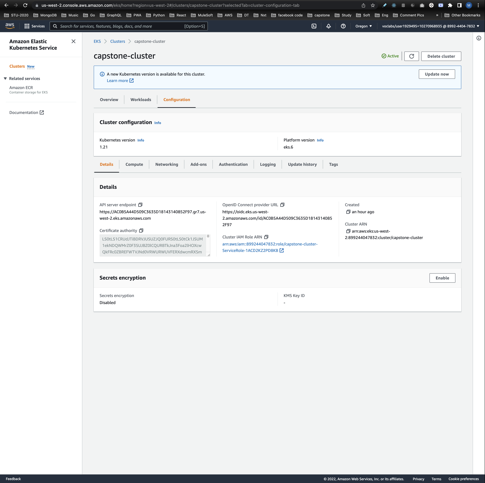

# Udacity Capstone Project: Cloud DevOps Engineer Nanodegree

## Submission

| CRITERIA | SPECIFICATIONS | IMPLEMENTATION EXPLAINATION                                                                                              | SCREENSHOT                                                                                                                                      |
| ----------- | ----------- |--------------------------------------------------------------------------------------------------------------------------|-------------------------------------------------------------------------------------------------------------------------------------------------|
| Use image repository to store Docker images   | The project uses a centralized image repository to manage images built in the project. After a clean build, images are pushed to the repository.| Use Docker Hub                                                                                                           |                                                                                                |
| Execute linting step in code pipeline   | Code is checked against a linter as part of a Continuous Integration step (demonstrated w/ two screenshots)| Use hadolint                                                                                                             |                                                                                                              |
| Build a Docker container in a pipeline   | The project takes a Dockerfile and creates a Docker container in the pipeline.| Build & Push image to Docker Hub                                                                                         |                                                                                                      |
| The Docker container is deployed to a Kubernetes cluster   | The cluster is deployed with CloudFormation or Ansible. This should be in the source code of the student’s submission.| Use CloudFormation to deploy EKS                                                                                         |    |
| Use Blue/Green Deployment or a Rolling Deployment successfully   | The project performs the correct steps to do a blue/green or a rolling deployment into the environment selected. Student demonstrates the successful completion of chosen deployment methodology with screenshots. | Uswe `kubectl rollout restart` to rolling update and update pod's label `pipeline` with pipeline ID after rolling update |                                                                 |
